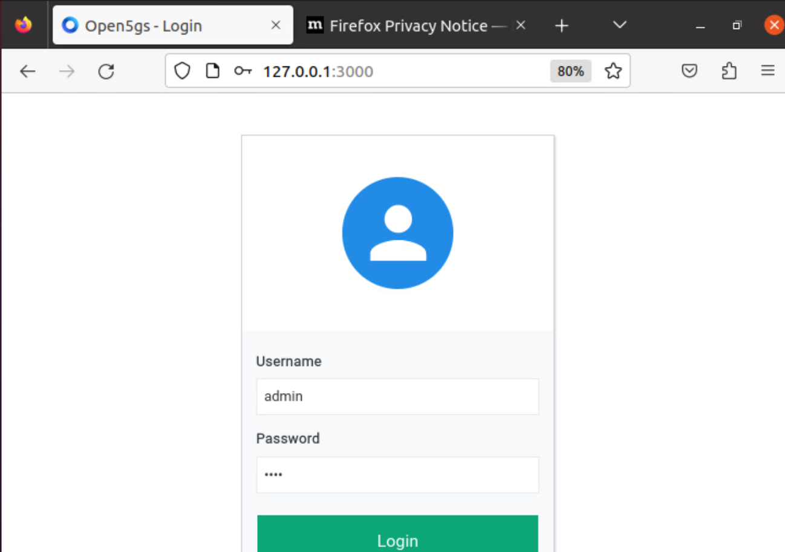

# Getting Started
The 5G environment consists of utilizing two opensource projects: Open5GS and UERANSIM

* Open5GS is an implementation of the 4G and 5G Core Network based on the 3GPP specifications. 
* UERANSIM is an 5G User Equipment (UE) and RAN (gNB) simulation to simulate the behavior and functionalities in a 5G network environment. UE and RAN can be considered as a 5G mobile phone and a base station in basic terms. The project can be used for testing 5G Core Network and studying 5G System.

The following documentation shows the required steps to combine both projects in order to deploy a 5G network environment. 

# Open5GS - CP 

## Getting MongoDB

* Import the public key used by the package management system.

```bash
sudo apt update
sudo apt install wget gnupg -y
wget -qO - https://www.mongodb.org/static/pgp/server-6.0.asc | sudo apt-key add -

```

* Create the list file /etc/apt/sources.list.d/mongodb-org-6.0.list for your version of Ubuntu.

```bash
echo "deb [ arch=amd64,arm64 ] https://repo.mongodb.org/apt/ubuntu focal/mongodb-org/6.0 multiverse" | sudo tee /etc/apt/sources.list.d/mongodb-org-6.0.list

```

* Install the MongoDB packages.

```bash
sudo apt update 
sudo apt install -y mongodb-org
sudo systemctl start mongod
sudo systemctl enable mongod
```


## Getting Open5GS

* Ubuntu makes it easy to install Open5GS as shown below.

```bash 
sudo add-apt-repository ppa:open5gs/latest
sudo apt update
sudo apt install open5gs -y
```

* Modify the config files for AMF and SMF. This is only for the control Plane

```bash
cd /etc/open5gs
```

* Replace the corresponding IP address that will be used for the AMF. In our case, it's *10.102.211.14*

```bash
sudo nano amf.yaml
```

```diff
amf:
    sbi:
      - addr: 127.0.0.5
        port: 7777
    ngap:
-      - addr: 127.0.0.5
+      - addr: 10.102.211.14
    metrics:
      - addr: 127.0.0.5
        port: 9090
    guami:
      - plmn_id:
-          mcc: 999
-          mnc: 70
+          mcc: 001
+          mnc: 01
        amf_id:
          region: 2
          set: 1
    tai:
      - plmn_id:
-          mcc: 999
-          mnc: 70
+          mcc: 001
+          mnc: 01
+        tac: 1
    plmn_support:
      - plmn_id:
-          mcc: 999
-          mnc: 70
+          mcc: 001
+          mnc: 01
        s_nssai:
          - sst: 1
    security:
        integrity_order : [ NIA2, NIA1, NIA0 ]
        ciphering_order : [ NEA0, NEA1, NEA2 ]
    network_name:
        full: Open5GS
    amf_name: open5gs-amf0
```


```bash
sudo nano smf.yaml
```
* Replace the corresponding IP address that will be used for the SMF and UPF. In our case, it's *10.102.211.106* for the SMF and *10.102.211.76* for the UPF

```diff
smf:
    sbi:
      - addr: 127.0.0.4
        port: 7777
    pfcp:
-      - addr: 127.0.0.4
-      - addr: ::1
+      - addr: 10.102.211.106
+      #- addr: ::1
    gtpc:
      - addr: 127.0.0.4
-      - addr: ::1
+      #- addr: ::1
    gtpu:
      - addr: 127.0.0.4
-      - addr: ::1
+      #- addr: ::1
    metrics:
      - addr: 127.0.0.4
        port: 9090
    subnet:
      - addr: 10.45.0.1/16
      - addr: 2001:db8:cafe::1/48
    dns:
      - 8.8.8.8
      - 8.8.4.4
      - 2001:4860:4860::8888
      - 2001:4860:4860::8844
    mtu: 1400
    ctf:
      enabled: auto
    freeDiameter: /home/cp/open5gs/install/etc/freeDiameter/smf.conf


upf:
    pfcp:
-      - addr: 127.0.0.7
+      - addr: 10.102.211.76

```


* 
    the AMF and SMF service

```bash
sudo systemctl restart open5gs-amfd.service
sudo systemctl restart open5gs-smfd.service
```

* Check that the AMF and SMF service is running properly


```bash
sudo systemctl status open5gs-amfd.service
sudo systemctl status open5gs-smfd.service
```


## Building the WebUI of Open5GS

The WebUI allows you to interactively edit subscriber data. While it is not essential to use this, it makes things easier when you are just starting out on your Open5GS adventure. (A command line tool is available for advanced users).

Node.js is required to install the WebUI of Open5GS

Debian and Ubuntu based Linux distributions can install Node.js as follows:

```bash
sudo apt install curl -y
curl -fsSL https://deb.nodesource.com/setup_18.x | sudo -E bash -
sudo apt install nodejs
```

* You can now install WebUI of Open5GS.

```bash
curl -fsSL https://open5gs.org/open5gs/assets/webui/install | sudo -E bash -
```


## Register Subscriber Information

Connect to http://127.0.0.1:3000 and login with admin account.

Username : admin
Password : 1423

You can change the password after login 

<p align="center">
  
</p>

* After accessing the WebUI, follow the below steps to add a subscriber. Our first subscriber IMSI is 001010000000001, and we'll leave the default settings. 

<p align="center">
  
</p>


<p align="center">
  
</p>

<p align="center">
  
</p>


<p align="center">
  
</p>


# Open5GS - UP 


```bash
sudo apt update && sudo apt upgrade -y 
sudo apt install openssh-server -y 
```

**Remember to make a snapshot**


## Getting Open5GS

* Ubuntu makes it easy to install Open5GS as shown below.

```bash 
sudo add-apt-repository ppa:open5gs/latest
sudo apt update
sudo apt install open5gs -y
```


* Modify the config files for UPF. This is only for the User Plane

```bash
cd /etc/open5gs
```


```bash
sudo nano upf.yaml
```

* Replace the corresponding IP address that will be used for the UPF. In our case, it's *10.102.211.76*

```diff
upf:
    pfcp:
-      - addr: 127.0.0.7
+      - addr: 10.102.211.76
    gtpu:
-      - addr: 127.0.0.7
+      - addr: 10.102.211.76
    subnet:
      - addr: 10.45.0.1/16
      - addr: 2001:db8:cafe::1/48
    metrics:
      - addr: 127.0.0.7
        port: 9090
```


* Restart the UPF service

```bash
sudo systemctl restart open5gs-upfd.service
```

* Check that the upf service is running properly


```bash
sudo systemctl status open5gs-upfd.service
```

* Allow UE network traffic to access the internet. 

```bash
sudo sysctl -w net.ipv4.ip_forward=1
sudo iptables -t nat -A POSTROUTING -s 10.45.0.0/16 ! -o ogstun -j MASQUERADE
```


# UERANSIM - gNB

## Getting the UERANSIM

```bash
sudo apt update and sudo apt upgrade -y 
sudo apt install openssh-server -y 
sudo apt install git -y
```

* Clone repo 

```bash 
cd ~
git clone https://github.com/aligungr/UERANSIM
cd UERANSIM
```

* Install the required dependencies 

```bash 
sudo apt install make
sudo apt install gcc
sudo apt install g++
sudo apt install libsctp-dev lksctp-tools
sudo apt install iproute2
sudo snap install cmake --classic
```

## Build UERANSIM

```bash 
cd ~/UERANSIM
make
```

## gNB Configuration

* Make a copy of the original open5gs-gnb config file, and edit the copy. Also, replace the corresponding IP address of the gNB. 

```bash 
cd config
sudo cp open5gs-gnb.yaml open5gs-gnb1.yaml
sudo nano open5gs-gnb1.yaml
```

```diff
-mcc: '999'          # Mobile Country Code value
+mcc: '001'          # Mobile Country Code value

-mnc: '70'           # Mobile Network Code value (2 or 3 digits)
+mnc: '01'           # Mobile Network Code value (2 or 3 digits)

nci: '0x000000010'  # NR Cell Identity (36-bit)
idLength: 32        # NR gNB ID length in bits [22...32]
+tac: 1              # Tracking Area Code

-linkIp: 127.0.0.1   # gNB's local IP address for Radio Link Simulation (Usually same with local IP)
-ngapIp: 127.0.0.1   # gNB's local IP address for N2 Interface (Usually same with local IP)
-gtpIp: 127.0.0.1    # gNB's local IP address for N3 Interface (Usually same with local IP)

+linkIp: 10.102.211.66   # gNB's local IP address for Radio Link Simulation (Usually same with local IP)
+ngapIp: 10.102.211.66   # gNB's local IP address for N2 Interface (Usually same with local IP)
+gtpIp: 10.102.211.66    # gNB's local IP address for N3 Interface (Usually same with local IP)


# List of AMF address information
amfConfigs:
-  - address: 127.0.0.5
+  - address: 10.102.211.14
    port: 38412

# List of supported S-NSSAIs by this gNB
slices:
  - sst: 1

# Indicates whether or not SCTP stream number errors should be ignored.
ignoreStreamIds: true```


## Start using the gNB - UERANSIM 

After completing configurations and setups, now you can start using UERANSIM.
```

Run the following command to start the gNB, and make sure that the config is successful:

```bash 
cd ..
./build/nr-gnb -c config/open5gs-gnb1.yaml
```


# UERANSIM - UE

## Getting the UERANSIM

```bash
sudo apt update and sudo apt upgrade -y 
sudo apt install openssh-server -y 
sudo apt install git -y
```

* Clone repo 

```bash 
cd ~
git clone https://github.com/aligungr/UERANSIM
cd UERANSIM
```

* Install the required dependencies 

```bash 
sudo apt install make
sudo apt install gcc
sudo apt install g++
sudo apt install libsctp-dev lksctp-tools
sudo apt install iproute2
sudo snap install cmake --classic
```

## Build UERANSIM

```bash 
cd ~/UERANSIM
make
```

## UE Configuration

* Make a copy of the original open5gs-ue config file, and edit the copy. Also, replace the corresponding IP address of the gNB, and make sure that the IMSI matches the one we added using the WebUI. 

```bash 
cd config
sudo cp open5gs-ue.yaml open5gs-ue1.yaml
sudo nano open5gs-ue1.yaml
```


```diff
# IMSI number of the UE. IMSI = [MCC|MNC|MSISDN] (In total 15 digits)
-supi: 'imsi-999700000000001'
+supi: 'imsi-001010000000001'
# Mobile Country Code value of HPLMN
-mcc: '999'
+mcc: '001'
# Mobile Network Code value of HPLMN (2 or 3 digits)
-mnc: '70'
+mnc: '01'

# Permanent subscription key
key: '465B5CE8B199B49FAA5F0A2EE238A6BC'
# Operator code (OP or OPC) of the UE
op: 'E8ED289DEBA952E4283B54E88E6183CA'
# This value specifies the OP type and it can be either 'OP' or 'OPC'
opType: 'OPC'
# Authentication Management Field (AMF) value
amf: '8000'
# IMEI number of the device. It is used if no SUPI is provided
imei: '356938035643803'
# IMEISV number of the device. It is used if no SUPI and IMEI is provided
imeiSv: '4370816125816151'

# List of gNB IP addresses for Radio Link Simulation
gnbSearchList:
-  - 127.0.0.1
+  - 10.102.211.66

# UAC Access Identities Configuration
uacAic:
  mps: false
  mcs: false

# UAC Access Control Class
uacAcc:
  normalClass: 0
  class11: false
  class12: false
  class13: false
  class14: false
  class15: false

# Initial PDU sessions to be established
sessions:
  - type: 'IPv4'
    apn: 'internet'
    slice:
      sst: 1

# Configured NSSAI for this UE by HPLMN
configured-nssai:
  - sst: 1

# Default Configured NSSAI for this UE
default-nssai:
  - sst: 1
    sd: 1

# Supported integrity algorithms by this UE
integrity:
  IA1: true
  IA2: true
  IA3: true

# Supported encryption algorithms by this UE
ciphering:
  EA1: true
  EA2: true
  EA3: true

# Integrity protection maximum data rate for user plane
integrityMaxRate:
  uplink: 'full'
  downlink: 'full'

```


## Start using the UE - UERANSIM 

After completing configurations and setups, now you can start using UERANSIM.

Run the following command to start the UE:

```bash 
cd ..
sudo ./build/nr-ue -c config/open5gs-ue1.yaml
```


